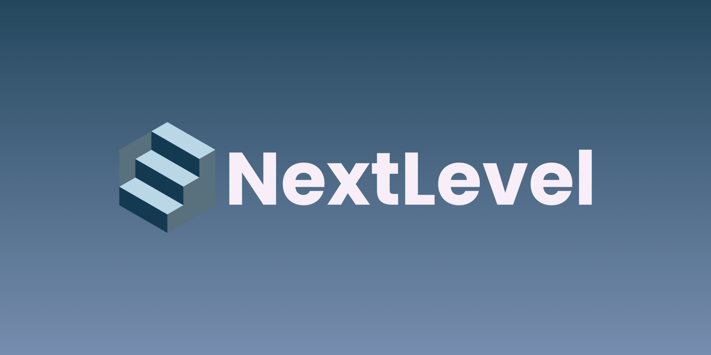
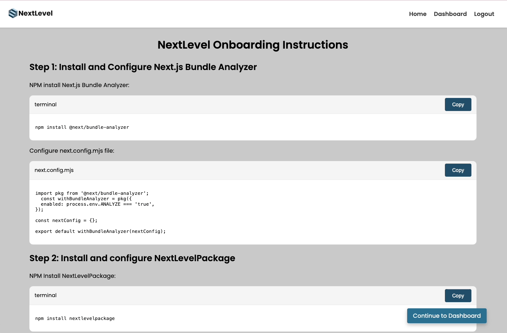

<div align='center'>

<p align="center">
    
</p>

</div>

<div align='center'>


</div>

#

<a href="https://www.nextlevel-dash.com/"></a>
<a href="https://www.linkedin.com/company/nextlevel-dash/"></a>
<a href="https://www.npmjs.com/package/nextlevelpackageevelpackage"></a>

In recent years, Next.js has gained immense popularity with developers, however many struggle to optimize the performance of their Next.js applications due to a lack of visibility into specific build and runtime metrics, making it difficult to identify and resolve bottlenecks efficiently.

NextLevel is a performance metrics dashboard tailored to Next.js applications that visualizes critical data, such as build time and key web vitals, enabling developers to pinpoint inefficiencies and improve development productivity and end-user experience.

<p align="center">
    
</p>

## Getting Started

1. To get started, visit nextlevel-dash.com and create an account. After account creation, you will be navigated to an onboarding page which will direct you to complete the below steps.

2. Install configure next.js bundle analyzer in your Next.js application

    NPM install Next.js Bundle Analyzer:
    ```bash
    npm install @next/bundle-analyzer
    ```

    Configure next.config.mjs file:
    ```bash
    import pkg from '@next/bundle-analyzer';
    const withBundleAnalyzer = pkg({
        enabled: process.env.ANALYZE === 'true',
    });

    const nextConfig = {};

    export default withBundleAnalyzer(nextConfig);
    ```

3. Install and configure our npm package, NextLevelPackage, through the terminal. It can also be found [here](https://www.npmjs.com/package/nextlevelpackage).

    NPM Install NextLevelPackage:
    ```bash
    npm install nextlevelpackage
    ```

    Import NextLevelPackage in layout.js:
    ```bash
    import NextWebVitals from 'nextlevelpackage';
    ```

    Add NextWebVitals component in RootLayout body:
    ```bash
    export default function RootLayout({ children }) {
        return (
            <html lang="en">
            <body>
                <NextWebVitals />
                {children}
            </body>
            </html>
        );
    }
    ```

4. Configure yoour Environmental Variables

    Add the following line to your .env.local file:
    ```bash
    NEXT_PUBLIC_API_KEY=<your-api-key>
    ```
    When you create an account, the setup page will provide you with your API key.
    
5.  Add Build Script to package.json

    Add the following script to your package.json:
    ```bash
    "scripts": {
        "nextlevelbuild": "node ./node_modules/nextlevelpackage/cli.js"
    }
    ```

    Run this build script instead of 'npm next build' to track metrics in the dashboard:
    ```bash
    npm run nextlevelbuild
    ```

6. Navitage to your NextLevel dashboard to view tracked metrics!

## Tracked Metrics

Metrics displayed on the dashboard include:

- Time to First Byte:
  - measures the time taken from a user's request to the first byte of data received from the server, indicating server responsiveness.
- Largest Contentful Paint:
  - gauges the time it takes for the largest visible content element on a webpage to load, impacting user perception of loading speed.
- First Contentful Paint:
  - tracks the time from page load to when the first piece of content is rendered on the screen, marking the start of the visual loading process.
- First Input Delay:
  - measures the delay between the user's first interaction with the page and the browser's response, reflecting input responsiveness.
- Interaction to Next Paint:
  - evaluates the time from user interaction to the next visual update, assessing how quickly a page responds to user inputs.
- Cumulative Layout Shift:
  - quantifies the total of all individual layout shifts that occur during the entire lifespan of the page, indicating visual stability.
- Build Time:
  - refers to the duration taken to compile and bundle code and assets into a deployable format during the development process.
- Bundle Size:
  - denotes the total size of all the compiled assets sent to the client, affecting load times and overall performance.

By default, the overview data covers the last 24 hours. You can modify the time period using the date and time selector located in the top right corner of the dashboard.

There are also gauges that track the averages of each metric over a set period of time. From these averages there will also be a performance score displayed ranging from "poor" to "needs work" to "great." This will notify you if your application needs to make some changes to improve its performance. 

## Contribution Guidelines

### Contribution Method

We welcome your contributions to the NextLevel product!

1. Fork the repo
2. Create your feature branch (`git checkout -b feature/newFeature`) and create your new feature
3. Commit your changes (`git commit -m 'Added [new-feature-description]'`)
4. Push to the branch (`git push origin feature/newFeature`)
5. Make a Pull Request
6. The NextLevel team will review the feature and approve!

### Looking Ahead

Here is a list of features being considered by our team:

- Tracking individual page/component build time via the npm package
- Allow users to track metrics for multiple codebases through their dashboard
- Create organizations so multiple users can access an organization's dashboard
- Enhanced security through change password and email functionality
- A dark mode and light mode feature to reduce eye strain
- A completed forgot password and remember me functionality
- Fix CLS gauge so that the marker is at the correct position

## Contributors

- Frederico Aires da Neto: [GitHub](https://github.com/FredAires) | [LinkedIn](https://www.linkedin.com/in/frederico-neto-a3722b221/)
- Kim Cuomo: [GitHub](https://github.com/kimcuomo) | [LinkedIn](https://www.linkedin.com/in/kimcuomo/)
- Ian Mann: [GitHub](https://github.com/ianmannn) | [LinkedIn](https://www.linkedin.com/in/iancmann99/)
- Nelly Segimoto: [GitHub](https://github.com/nellysegi) | [LinkedIn](https://www.linkedin.com/in/nellysegimoto/)

## License

Distributed under the MIT License. See LICENSE for more information.